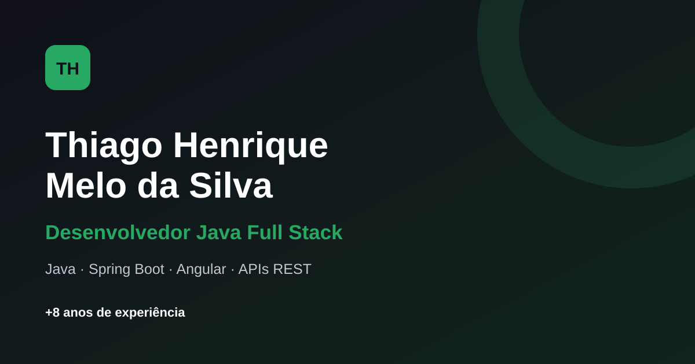

# Portfólio Angular

Portfólio pessoal desenvolvido em Angular 17 para apresentar projetos, experiências profissionais e stack técnica em uma interface responsiva.

O projeto foi construído como prática de estudos com base no curso de Angular da Udemy:
https://www.udemy.com/course/curso-de-angular/?srsltid=AfmBOorFvdxsf1cQa5RmcA7aLAWTvn2Aq0lE78ApRW80692k5pSbkWnX

## Demo

Aplicação publicada no GitHub Pages:

https://thiago-jv.github.io/curso-angular-portifolio/

## Preview



## Funcionalidades

- Apresentação pessoal com links de contato.
- Sessão de conhecimentos com stack técnica.
- Sessão de experiências profissionais e acadêmicas.
- Listagem de projetos com carregamento tardio usando `@defer`.
- Modal com detalhes dos projetos utilizando Angular Material.
- Layout responsivo para desktop e mobile.

## Stack

- Angular 17
- TypeScript
- SCSS
- Angular Material
- RxJS
- GitHub Pages

## Estrutura principal

```text
src/app/modules/portfolio/
	components/
		header/
		knowledge/
		experiences/
		projects/
		dialog/dialog-projects/
	interface/
	enum/
	pages/home/
```

## Como executar localmente

```bash
npm install
npm start
```

Abra `http://localhost:4200/` no navegador.

## Scripts disponíveis

```bash
npm start            # ambiente de desenvolvimento
npm run build        # build padrão
npm run build:gh-pages
npm run deploy:gh-pages
npm test
```

## Deploy no GitHub Pages

O deploy está configurado para publicar a aplicação no branch `gh-pages` com o `base-href` correto para este repositório.

```bash
npm run deploy:gh-pages
```

URL de publicação:

https://thiago-jv.github.io/curso-angular-portifolio/

## Objetivo do projeto

Consolidar conceitos práticos de Angular, componentização, organização de estilos com SCSS e publicação de aplicações estáticas no GitHub Pages.
